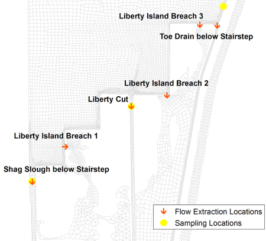
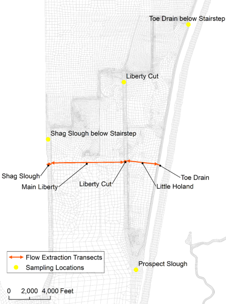

```{r setup, include = FALSE}
knitr::opts_chunk$set(echo = TRUE)
```

```{css make code chunks scrollable, echo = FALSE}
pre {
  max-height: 750px;
  overflow-y: auto;
}
```

# Purpose

This file provides the code used to calculate loads for the Yolo Bypass Mass Balance study. These are the final calculated loads used in all analyses in Technical Appendix B in the Open Water Final Report.

# Intital Setup

```{r load packages, message = FALSE, warning = FALSE}
# Load packages
library(tidyverse)
library(lubridate)
library(openwaterhg)
```

The code in this file uses the datasets included in the `openwaterhg` package. The following datasets in this R package are exactly the same as the water concentration and flow data in the following files:

1. The `conc_data` dataset contains all water concentration data collected for the Yolo Bypass Mass Balance Study. This dataset originated from the **"NormalSamples.csv"** file and contains the exact same concentration data. The raw data for this dataset were integrated, cleaned, and QA'ed in the [/YB_Mass_Balance/Concentrations/Compile_and_Clean_Conc_Data_FloodEvents.R](https://github.com/mountaindboz/Open-Water-Hg-Studies/blob/master/YB_Mass_Balance/Concentrations/Compile_and_Clean_Conc_Data_FloodEvents.R) script file within the Open-Water-Hg-Studies GitHub repository.
2. The `daily_flow_data_se` dataset contains daily average flow data for the 11 sampling events conducted for the Yolo Bypass Mass Balance study. This dataset originated from the **"Sampling Event Flows"** sheet in the **"YB_Daily_Avg_Flow.xlsx"** spreadsheet and contains the exact same flow data. The raw data for this dataset were integrated, cleaned, and averaged in the [/YB_Mass_Balance/Flows/Process_Flow_Data.R](https://github.com/mountaindboz/Open-Water-Hg-Studies/blob/master/YB_Mass_Balance/Flows/Process_Flow_Data.R) script file within the Open-Water-Hg-Studies GitHub repository.
3. `part_conc_calc` contains the calculated particulate concentration data for mercury, methylmercury, and organic carbon for the Yolo Bypass Mass Balance Study. Particulate concentrations were calculated as the difference between the unfiltered and filtered concentrations. The calculations for this dataset are in the [/YB_Mass_Balance/Concentrations/Calculate_Particulate_Fractions.R](https://github.com/mountaindboz/Open-Water-Hg-Studies/blob/master/YB_Mass_Balance/Concentrations/Calculate_Particulate_Fractions.R) script file within the Open-Water-Hg-Studies GitHub repository.

Additionally, the code in this file uses various functions included in the `openwaterhg` package. For more information about the `openwaterhg` R package including instructions on how to install it on your computer, check out the [Open-Water-Hg-Studies GitHub repository](https://github.com/mountaindboz/Open-Water-Hg-Studies).

# Water Concentrations

## Prepare Data

First, we need to: 

* Remove all water concentration values flagged with a `QualCode` of "R" or not valid
* Convert results measured below their detection limits to values equal either to their Method Detection Limit (MDL) or Reporting Limit (RL)
* Combine the water concentration data in `conc_data` to the calculated particulate concentration data for Hg, MeHg, and organic carbon

```{r clean conc data 1, warning = FALSE}
# Clean conc_data
conc_data_clean <- conc_data %>% 
  # Remove samples with QualCode "R"
  filter(is.na(QualCode) | !str_detect(QualCode, "^R")) %>%
  # Create a new variable Conc, which is a numeric version of Result with the MDL and RL for the below detection values
  add_num_result() %>% 
  # Clean up df
  select(SampleCode:Analyte, Conc, RL:QualCode)

# Bind conc_data with calculated data for the particulate fractions of Hg, MeHg, and organic carbon
all_conc <- bind_rows(conc_data_clean, part_conc_calc)
```

Next, we need to structure the `all_conc` dataframe to be used for the load calculations including:

* Keeping only the necessary stations and parameters
* Creating a few additional variables to identify each unique sampling event, the year, and the number of significant digits in the concentration values

```{r clean conc data 2, message = FALSE}
# Create a vector of all stations to include
Stations <- c(
  "Cache Slough near Ryer Island",
  "CCSB- Low Flow Channel",
  "CCSB Overflow Weir- North",
  "CCSB Overflow Weir- South",
  "Fremont Weir- East Side",
  "Fremont Weir- Middle",
  "Fremont Weir- West Side",
  "Knights Landing Ridge Cut",
  "Liberty Cut below Stairsteps",
  "Miner Slough near Sac River",
  "Putah Creek at Mace Blvd",           
  "Sac River above the Sacramento Weir",
  "Shag Slough below Stairsteps",
  "Toe Drain at 1/2 Lisbon"            
)
  
# Create a vector of all parameters to include
Analytes <- c(
  "Chloride- filtered",
  "DOC",
  "Iron- filtered",
  "Manganese- filtered",
  "MeHg- filtered",
  "MeHg- particulate",
  "MeHg- total",
  "POC",
  "THg- filtered",
  "THg- particulate",
  "THg- total",
  "TOC",
  "TSS",
  "VSS"
)

# Structure all_conc dataframe to be used for load calculations
all_conc_clean <- all_conc %>% 
  # Keep only necessary data
  filter(
    StationName %in% Stations,
    Analyte %in% Analytes
  ) %>% 
  # Create a standardized variable to identify each unique sampling event
  add_samplingevent() %>% 
  mutate(
    # Add a variable for the year
    Year = year(SampleDate),
    # Calculate the number of significant digits in the Conc values
    digits = case_when(
      Analyte %in% c("Iron- filtered", "Manganese- filtered") ~ 3,
      str_detect(Analyte, "^MeHg") & Conc < 0.01 ~ 1,
      str_detect(Analyte, "^MeHg") & Conc < 0.1 ~ 2,
      str_detect(Analyte, "^MeHg") ~ 3,
      Analyte %in% c("Chloride- filtered", "TSS", "VSS") & Conc < 10 ~ 1,
      Analyte %in% c("Chloride- filtered", "TSS", "VSS") & Conc < 100 ~ 2,
      Analyte %in% c("Chloride- filtered", "TSS", "VSS") ~ 3,
      str_detect(Analyte, "^THg|OC$") & Conc < 1 ~ 1,
      str_detect(Analyte, "^THg|OC$") & Conc < 10 ~ 2,
      str_detect(Analyte, "^THg|OC$") & Conc ~ 3
    )
  ) %>%
  # Keep only necessary variables
  select(
    SamplingEvent,
    Year,
    StationName,
    Analyte,
    Conc,
    Units,
    digits
  )
```

## Average Concentration data for two Input stations

The water concentration data for the 3 Fremont Weir sampling locations (West, Middle, and East) and the 2 CCSB Overflow Weir stations (North and South) need to be averaged before calculating loads for these inputs.

```{r avg fremont ccsb conc, message = FALSE}
# CCSB Overflow Weir- North and South
CCSB <- all_conc_clean %>% 
  filter(str_detect(StationName, "Overflow")) %>% 
  # Group and summarize to average the North and South stations
  group_by(SamplingEvent, Year, Analyte, Units) %>% 
  summarize(
    "CCSB- Overflow Weir" = mean(Conc),
    digits = min(digits)
  ) %>%
  ungroup() %>% 
  # Restructure dataframe back into long format
  pivot_longer(
    cols = "CCSB- Overflow Weir", 
    names_to = "StationName", 
    values_to = "Conc"
  )

# Fremont Weir
Fremont <- all_conc_clean %>% 
  # Filter out Fremont Weir stations
  filter(str_detect(StationName, "^Fremont Weir")) %>% 
  # Group and summarize to average the Fremont Weir stations
  group_by(SamplingEvent, Year, Analyte, Units) %>% 
  summarize(
    "Fremont Weir" = mean(Conc),
    digits = min(digits),
  ) %>%
  ungroup() %>% 
  # Restructure dataframe back into long format
  pivot_longer(
    cols = "Fremont Weir", 
    names_to = "StationName", 
    values_to = "Conc"
  )

# Add back CCSB and Fremont Weir dataframes to all_conc_clean dataframe
all_conc_clean1 <- all_conc_clean %>% 
  filter(!str_detect(StationName, "Overflow|^Fremont")) %>% 
  bind_rows(CCSB, Fremont)

# Clean up
rm(CCSB, Fremont)
```

## Estimate a few Organic Carbon values

The DOC concentration was greater than the TOC concentration at Liberty Cut on 2/16/2017. As a result, we need to estimate the TOC, DOC, and POC values for this station on this date by using the averages of the two adjacent stations, Toe Drain at 1/2 Lisbon and Shag Slough.

```{r estimate oc conc, message = FALSE}
# Estimate the TOC, DOC, and POC concentrations at Liberty Cut on 2/16/2017
oc_out_feb16 <- all_conc_clean1 %>% 
  filter(
    StationName %in% c("Toe Drain at 1/2 Lisbon", "Shag Slough below Stairsteps"),
    Analyte %in% c("TOC", "DOC", "POC"),
    SamplingEvent == "Feb 14-15, 2017"
  ) %>% 
  group_by(SamplingEvent, Year, Analyte, Units) %>% 
  summarize(
    Conc = mean(Conc),
    digits = min(digits)
  ) %>% 
  ungroup() %>% 
  mutate(StationName = "Liberty Cut below Stairsteps")

all_conc_clean2 <- bind_rows(all_conc_clean1, oc_out_feb16)

# Clean up
rm(oc_out_feb16)
```

## Create some additional outlet sampling locations

During most sampling events, DWR staff collected samples at 3 locations near the Stairsteps drainage canals to represent the water leaving the southern end of the Bypass above Liberty Island. However, the DWR Semi-implicit Cross-scale Hydroscience Integrated System Model (SCHISM) provided flow estimates for additional outlet locations for both the 2016 and 2017 floods. Therefore, we need to assign concentration values to these additional locations in order to calculate total outlet loads.

### 2016 Flood

For the 2016 flood, SCHISM provided water flows for 6 outlet locations that drain into Liberty Island (Figure 1). We used the following water sampling locations to estimate concentrations for these 6 SCHISM outlet locations:

SCHISM outlet location      | Water Sampling Location
--------------------------- | -----------------------
Shag Slough below Stairstep | Shag Slough below the Stairsteps
Liberty Island Breach 1     | Shag Slough below the Stairsteps
Liberty Cut                 | Liberty Cut below the Stairsteps
Liberty Island Breach 2     | Liberty Cut below the Stairsteps
Liberty Island Breach 3     | Toe Drain at 1/2 Lisbon
Toe Drain below Stairstep   | Toe Drain at 1/2 Lisbon



```{r estimate outlet conc 2016, message = FALSE}
# Define concentration values for the outlets for the 2016 sampling event
OutSta_2016_c <- all_conc_clean2 %>%
  # Filter out the outlet stations
  filter(
    Year == 2016,
    StationName %in% c(
      "Liberty Cut below Stairsteps",
      "Shag Slough below Stairsteps",
      "Toe Drain at 1/2 Lisbon"
    )
  ) %>%
  # Restructure the dataframe
  pivot_wider(
    id_cols = -digits,
    names_from = StationName,
    values_from = Conc
  ) %>%
  rename(
    Liberty = "Liberty Cut below Stairsteps",
    Shag = "Shag Slough below Stairsteps",
    Toe = "Toe Drain at 1/2 Lisbon"
  ) %>%
  # Create new variables for Liberty Island Breach locations
  mutate(
    "Liberty Island Breach 1" = Shag,  #this breach is closest to the Shag Slough site
    "Liberty Island Breach 2" = Liberty,  #this breach is closest to the Liberty Cut site
    "Liberty Island Breach 3" = Toe  #this breach is closest to the Toe Drain at 1/2 Lisbon site
  ) %>%
  # Remove Liberty, Shag, and Toe since they are no longer necessary
  select(-c(Toe, Liberty, Shag)) %>%
  # Pivot dataframe back into long format
  pivot_longer(
    cols = c("Liberty Island Breach 1", "Liberty Island Breach 2", "Liberty Island Breach 3"),
    names_to = "StationName",
    values_to = "Conc"
  )

# Define significant digits for each new station
OutSta_2016_d <- all_conc_clean2 %>%
  # Filter out the outlet stations
  filter(
    Year == 2016,
    StationName %in% c(
      "Liberty Cut below Stairsteps",
      "Shag Slough below Stairsteps",
      "Toe Drain at 1/2 Lisbon"
    )
  ) %>%
  # Restructure the dataframe
  pivot_wider(
    id_cols = -Conc,
    names_from = StationName,
    values_from = digits
  ) %>%
  rename(
    Liberty = "Liberty Cut below Stairsteps",
    Shag = "Shag Slough below Stairsteps",
    Toe = "Toe Drain at 1/2 Lisbon"
  ) %>%
  # Create new variables for Liberty Island Breach locations
  mutate(
    "Liberty Island Breach 1" = Shag,  #this breach is closest to the Shag Slough site
    "Liberty Island Breach 2" = Liberty,  #this breach is closest to the Liberty Cut site
    "Liberty Island Breach 3" = Toe  #this breach is closest to the Toe Drain at 1/2 Lisbon site
  ) %>%
  # Remove Liberty, Shag, and Toe since they are no longer necessary
  select(-c(Toe, Liberty, Shag)) %>%
  # Pivot dataframe back into long format
  pivot_longer(
    cols = c("Liberty Island Breach 1", "Liberty Island Breach 2", "Liberty Island Breach 3"),
    names_to = "StationName",
    values_to = "digits"
  )

# Join dataframes with concentrations and significant digits together
OutSta_2016 <- left_join(OutSta_2016_c, OutSta_2016_d)
```

### 2017 Flood

For the 2017 flood, water flows from the SCHISM model were separated into 5 segments along a cross-section of the Yolo Bypass just downstream of the Stairsteps drainage canals (Figure 2). With the exception of the April 11-12, 2017 sampling event, we used the following water sampling locations to estimate concentrations for these 5 SCHISM outlet segments:

SCHISM outlet segment | Water Sampling Location
--------------------- | -----------------------
Shag Slough           | Shag Slough below the Stairsteps
Main Liberty          | Either the Average of Liberty Cut and Shag Slough or just Liberty Cut depending upon the values of boron, specific conductance, and the ICP cations and metals
Liberty Cut           | Liberty Cut below the Stairsteps
Little Holland        | Average of Toe Drain and Liberty Cut
Toe Drain             | Toe Drain at 1/2 Lisbon

For both the April 11-12, 2017 sampling event and the 2014 mini-flood event, the flooding was less extensive and more confined to the eastern side of the Yolo Bypass. Therefore during these two events, sampling was conducted only at the Toe Drain at 1/2 Lisbon outlet location, which was used to estimate the concentration values of all water exiting the Bypass.



```{r estimate outlet conc 2017, message = FALSE}
# Define concentration values for the outlets for the 2017 sampling events
OutSta_2017_c <- all_conc_clean2 %>%
  # Filter out the outlet stations
  filter(
    Year == 2017,
    StationName %in% c(
      "Liberty Cut below Stairsteps",
      "Shag Slough below Stairsteps",
      "Toe Drain at 1/2 Lisbon"
    )
  ) %>%
  # Restructure the dataframe
  pivot_wider(
    id_cols = -digits,
    names_from = StationName,
    values_from = Conc
  ) %>%
  rename(
    Liberty = "Liberty Cut below Stairsteps",
    Shag = "Shag Slough below Stairsteps",
    Toe = "Toe Drain at 1/2 Lisbon"
  ) %>%
  # Create a new variable for Little Holland and assign values
  mutate(
    "Little Holland" = if_else(
      SamplingEvent != "Apr 11-12, 2017",
      (Toe + Liberty)/2,
      NULL  #only sampled Toe Drain at 1/2 Lisbon on April 12, 2017
    )
  ) %>%
  # Create a new variable for Main Liberty and assign values
  mutate(
    "Main Liberty" = case_when(
      # For sampling events with good mixing across the Bypass use the average of Liberty Cut and Shag Slough
      SamplingEvent %in% c("Jan 11-12, 2017", "Jan 31-Feb 1, 2017", "Feb 14-15, 2017", "Mar 1-2, 2017", "Mar 15-16, 2017") ~ (Liberty + Shag)/2,
      # For sampling events when Shag Slough was much different use the concentrations from Liberty Cut
      SamplingEvent %in% c("Jan 24-25, 2017", "Mar 28-29, 2017", "Apr 25-26, 2017") ~ Liberty
      # Only sampled Toe Drain on April 12, so not necessary to assign value for this event
    )
  ) %>%
  # Remove Liberty, Shag, and Toe since they are no longer necessary
  select(-c(Shag, Liberty, Toe)) %>%
  # Pivot dataframe back into long format
  pivot_longer(
    cols = c("Little Holland", "Main Liberty"),
    names_to = "StationName",
    values_to = "Conc"
  ) %>%
  # Remove NA values
  filter(!is.na(Conc))

# Define significant digits for each new station
  # Toe Drain at 1/2 Lisbon and Liberty Cut combination
  OutSta_2017_d_ToeLib <- all_conc_clean2 %>%
    # Filter out the outlet stations
    filter(
      Year == 2017,
      StationName %in% c(
        "Liberty Cut below Stairsteps",
        "Toe Drain at 1/2 Lisbon"
      )
    ) %>%
    group_by(SamplingEvent, Analyte) %>%
    summarize(digits = min(digits)) %>%
    ungroup()

  # Shag Slough and Liberty Cut combination
  OutSta_2017_d_ShagLib <- all_conc_clean2 %>%
    # Filter out the outlet stations
    filter(
      Year == 2017,
      StationName %in% c(
        "Liberty Cut below Stairsteps",
        "Shag Slough below Stairsteps"
      )
    ) %>%
    group_by(SamplingEvent, Analyte) %>%
    summarize(digits = min(digits)) %>%
    ungroup()

  # Just Liberty Cut
  OutSta_2017_d_Lib <- all_conc_clean2 %>%
    # Filter out the outlet stations
    filter(
      Year == 2017,
      StationName == "Liberty Cut below Stairsteps"
    ) %>%
    select(SamplingEvent, Analyte, digits)

# Join digits dataframes to the concentration dataframe based on calculation method
  # Little Holland
  little_holland <- OutSta_2017_c %>%
    filter(StationName == "Little Holland") %>%
    left_join(OutSta_2017_d_ToeLib)

  # Main Liberty- good mixing events
  main_lib_good_mix <- OutSta_2017_c %>%
    filter(
      StationName == "Main Liberty",
      SamplingEvent %in% c(
        "Jan 11-12, 2017",
        "Jan 31-Feb 1, 2017",
        "Feb 14-15, 2017",
        "Mar 1-2, 2017",
        "Mar 15-16, 2017"
      )
    ) %>%
    left_join(OutSta_2017_d_ShagLib)

  # Main Liberty- Shag Slough much different
  main_lib_shag_diff <- OutSta_2017_c %>%
    filter(
      StationName == "Main Liberty",
      SamplingEvent %in% c(
        "Jan 24-25, 2017",
        "Mar 28-29, 2017",
        "Apr 25-26, 2017"
      )
    ) %>%
    left_join(OutSta_2017_d_Lib)
```

Last, we need to add all of the estimated concentration values for the additional output locations to the `all_conc_clean2` dataframe.

```{r add extra output conc}
# Bind all df's together
all_conc_clean_f <-
  bind_rows(
    all_conc_clean2,
    OutSta_2016,
    little_holland,
    main_lib_good_mix,
    main_lib_shag_diff
  )

# Clean up
rm(
  all_conc,
  all_conc_clean,
  all_conc_clean1,
  all_conc_clean2,
  conc_data_clean,
  little_holland,
  main_lib_good_mix,
  main_lib_shag_diff,
  OutSta_2016,
  OutSta_2016_c,
  OutSta_2016_d,
  OutSta_2017_c,
  OutSta_2017_d_Lib,
  OutSta_2017_d_ShagLib,
  OutSta_2017_d_ToeLib
)
```


# Water Flows

## Prepare CCSB Flows

We only collected water samples at the CCSB- Low Flow Channel location during the last 3 sampling events in 2017 (March 28-29, April 11-12, and April 25-26), since it was greater than 30% of the total outflow from the CCSB only during these events. As a result, we need to add the flow from the Low Flow Channel to the flow from the Overflow Weir for the events when we only collected samples at the Overflow Weir.

```{r prepare ccsb flow, message = FALSE}
# Sum the CCSB flows for the sampling events when we didn't collect samples at the Low Flow Channel
ccsb_flow <- daily_flow_data_se %>% 
  # Filter out CCSB stations
  filter(
    str_detect(StationName, "^CCSB") &
    !SamplingEvent %in% c("Mar 28-29, 2017", "Apr 11-12, 2017", "Apr 25-26, 2017")
  ) %>% 
  # Group and summarize to sum the flows of the LFC and Overflow Weir stations
  group_by(SamplingEvent, Year, LocType) %>% 
  summarize("CCSB- Overflow Weir" = sum(Flow)) %>%
  ungroup() %>% 
  # Pivot dataframe back into long format
  pivot_longer(
    cols = "CCSB- Overflow Weir",
    names_to = "StationName",
    values_to = "Flow"
  )

# Add the CCSB flow data back to the daily flow data dataframe
daily_flow_data1 <- daily_flow_data_se %>% 
  # Remove the CCSB Stations to prevent duplicates
  filter(
    !(
      str_detect(StationName, "^CCSB") &
      !SamplingEvent %in% c("Mar 28-29, 2017", "Apr 11-12, 2017", "Apr 25-26, 2017")
    )
  ) %>%
  # Add summed CCSB flows
  bind_rows(ccsb_flow)

# Clean up
rm(ccsb_flow)
```

## Modify Outlet Flows

Instead of using the SCHISM outlet flow determinations to calculate the outlet loads of each sampling event, we will use the sums of the inlet flows to calculate outlet loads. We made this decision because some individual sampling events had water balance results with relatively large differences between the total inlet, SCHISM outlet, and below Liberty Island flows. See Technical Appendix B in the Open Water Final Report for more information.

To calculate outlet loads using the total input flows, we need to estimate the proportion of the total input flow to assign to each outlet location. We will scale the flow of each outlet by: 

1. Determining the flow proportions for each outlet by dividing the individual SCHISM flows by the total SCHISM outlet flow for each sampling event.  
2. Multiplying the total inlet flow by each of these proportions to scale the flow for each outlet location and sampling event to use in the load calculations.

For the two events when we only sampled the Toe Drain at 1/2 Lisbon outlet location (April 11-12, 2017 and Dec 22-23, 2014), we will use the total inlet flow to calculate the outlet loads.

```{r modify outlet flow, message = FALSE}
# Summarize the total input and output flows for each sampling event
flow_summ <- daily_flow_data1 %>%
  filter(LocType != "Below Liberty") %>% 
  group_by(SamplingEvent, Year, LocType) %>% 
  summarize(TotalFlow = sum(Flow)) %>% 
  ungroup() %>% 
  pivot_wider(names_from = LocType, values_from = TotalFlow)

# Pull out the total inlet flows for the two events when we only sampled the Toe Drain at 1/2 Lisbon outlet location - to be added back to the outlet flows later
total_inflow_2events <- flow_summ %>% 
  filter(SamplingEvent %in% c("Dec 22-23, 2014", "Apr 11-12, 2017")) %>% 
  # Remove the total outlet flow
  select(-c(Outlet)) %>% 
  # Rename variable to make the total inlet flow represent the outlet flow
  rename(Flow = Inlet) %>% 
  # Add a few variables to be able to bind it to the outlet flow data
  mutate(
    StationName = "Toe Drain at 1/2 Lisbon",
    LocType = "Outlet"
  )

# Scale the outlet flows
OutFlow <- daily_flow_data1 %>% 
  # Pull out the flow data for outlet locations
  filter(LocType == "Outlet") %>% 
  # Remove the two events when we only sampled the Toe Drain at 1/2 Lisbon outlet location
  filter(!SamplingEvent %in% c("Dec 22-23, 2014", "Apr 11-12, 2017")) %>% 
  # Join summary dataframe
  left_join(flow_summ) %>% 
  # Create a new variable for the adjusted flow values: (flow at site/total outflow) * total inflow
  mutate(FlowB = (Flow/Outlet) * Inlet) %>% 
  # Remove a few variables
  select(-c(Flow, Inlet, Outlet)) %>% 
  # Rename FlowB
  rename(Flow = FlowB) %>% 
  # Add back flow data for the two events when we only sampled the Toe Drain at 1/2 Lisbon station
  bind_rows(total_inflow_2events)

# Add the adjusted outflow data back to the daily flow data dataframe
daily_flow_data_f <- daily_flow_data1 %>% 
  # Remove the flow data for outlet locations to prevent duplicates
  filter(LocType != "Outlet") %>%
  # Add adjusted outflow data
  bind_rows(OutFlow)

# Clean up
rm(daily_flow_data1, OutFlow, total_inflow_2events)
```


# Load Calculations

We are now ready to join the water concentration and flow data together and compute loads for each sampling event, station, and parameter combination.

```{r calculate loads, message = FALSE}
loads <- all_conc_clean_f %>% 
  left_join(daily_flow_data_f) %>% 
  # Create new variables for loads and load units
  mutate(
    #The same conversion factor is used for all calculations
    Load = Conc * Flow * 28.317*60*60*24/1e9,  
    LoadUnits = case_when(
      str_detect(Units, "mg/L") ~ "1,000 kg/day",
      Units == "ug/L"           ~ "kg/day",
      Units == "ng/L"           ~ "g/day"
    )
  )
```

## Below Liberty Island Loads

We will not calculate the Below Liberty Island (BLI) loads for the March 15-16, 2016 sampling event since the BLI flows were much lower than the inlet flows for this event. So before calculating loads for BLI, we will remove the loads for Cache and Miner Sloughs for the March 15-16, 2016 sampling event.

```{r remove bli loads march 2016}
loads1 <- loads %>% 
  filter(!(Year == 2016 & LocType == "Below Liberty"))
```

We will use a different scaling method to make the Below Liberty Island (BLI) loads comparable to the inlet and outlet loads:

1. First, we will subtract the Miner Slough load from the Cache Slough load to estimate the BLI load for each sampling event. The Cache Slough site is downstream of the Yolo Bypass and Liberty Island, and Miner Slough enters Cache Slough between the Cache Slough site and the Bypass. Subtracting Miner Slough from Cache Slough provides an estimate of the load exiting the upper Yolo Bypass and Liberty Island to the downstream Delta.
2. Then, we will scale the BLI loads by multiplying them by the ratio of the total inlet flow to the BLI flow for each event.

```{r scale bli loads, message = FALSE}
# Resolve significant digits for Cache and Miner Sloughs
digits_bli <- loads1 %>% 
  filter(LocType == "Below Liberty") %>% 
  group_by(SamplingEvent, Analyte) %>% 
  summarize(digits = min(digits)) %>% 
  ungroup() %>% 
  mutate(StationName = "Below Liberty Island")

# Calculate Below Liberty Island loads using subtraction (Cache Sl - Miner Sl)
loads_bli <- loads1 %>% 
  filter(LocType == "Below Liberty") %>% 
  select(-c(Conc, Units, Flow, digits)) %>% 
  pivot_wider(names_from = StationName, values_from = Load) %>% 
  rename(
    Cache = "Cache Slough near Ryer Island",
    Miner = "Miner Slough near Sac River"
  ) %>% 
  mutate(
    Load = Cache - Miner,
    StationName = "Below Liberty Island"
  ) %>% 
  select(-c(Cache, Miner)) %>% 
  # add variable with significant digits
  left_join(digits_bli)

# Calculate Below Liberty Island flows using subtraction (Cache Sl - Miner Sl)
flow_bli <- daily_flow_data_f %>% 
  filter(LocType == "Below Liberty") %>% 
  select(-LocType) %>% 
  pivot_wider(names_from = StationName, values_from = Flow) %>% 
  rename(
    Cache = "Cache Slough near Ryer Island",
    Miner = "Miner Slough near Sac River"
  ) %>% 
  mutate(BelowLibertyFlow = Cache - Miner) %>% 
  select(-c(Cache, Miner))

# Calculate loads for Below Liberty Island that are scaled to the sum of the input flows
loads_bli_scaled <- flow_summ %>% 
  select(-Outlet) %>% 
  #Join the Below Liberty Island and Input flows for each sampling event
  right_join(flow_bli) %>% 
  #Join the Below Liberty Island loads for each sampling event
  right_join(loads_bli) %>%  
  mutate(ScaledLoad = Load * (Inlet/BelowLibertyFlow)) %>% 
  select(-c(BelowLibertyFlow, Inlet, Load)) %>% 
  rename(Load = ScaledLoad)

# Clean up
rm(digits_bli, flow_bli, flow_summ, loads_bli)
```

Now we can add the scaled BLI loads to the inlet and outlet loads.

```{r add scaled bli loads}
loads2 <- loads1 %>% 
  # Remove the BLI stations to prevent duplicates
  filter(LocType != "Below Liberty") %>% 
  bind_rows(loads_bli_scaled)
```

## Round All Loads

The final step is to round all loads to their appropriate number of significant figures based on the number of significant digits in the water concentration values.

```{r round loads sig fig}
loads_f <- loads2 %>% 
  mutate(Load = signif(Load, digits = digits)) %>% 
  # Select necessary variables for export
  select(
    SamplingEvent,
    Year,
    StationName,
    LocType,
    Analyte,
    Load,
    LoadUnits,
    digits
  )
```

## Export Loads

The calculated loads are now ready to be exported as a .csv file. This file will be added to the SharePoint site for the Open Water Final Report in the following location: [/Technical Appendices/Technical Appendix-B_Inlet-Outlet/Data/Final/YB_Inlet-Outlet_Loads.xlsx](https://cawater.sharepoint.com/:x:/r/sites/dwrdoc-owfr/Shared%20Documents/Technical%20Appendices/Technical%20Appendix-B_Inlet-Outlet/Data/Final/YB_Inlet-Outlet_Loads.xlsx?d=w172aceb35e0746e78ec277ac9b39c6b5&csf=1&web=1&e=Irw40X). We will also add this dataset of calculated loads to the `openwaterhg` package as `loads_calc`.

```{r export load data as csv, eval = FALSE}
# Code chunk is set to eval = FALSE, so this code is not executed when this file is knitted
# change eval option to TRUE when you want to export the data when knitting this file
loads_f %>% write_excel_csv("YB_Loads.csv", na = "")
```

End of script

