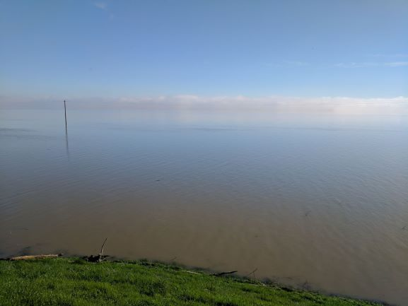

## Background
The focus of the Yolo Bypass Mass Balance study was to investigates mercury (Hg) and methylmercury (MeHg) loads entering and exiting the Yolo Bypass when it is actively flooding. This work is for compliance with the Delta Mercury Control Program (DMCP) promulgated by the Central Valley Regional Water Quality Control Board (CVRWQCB). DWR staff collected water samples for the study during the winters of 2014, 2016, and 2017. A majority of the samples were collected during the extended 4-month flood event in the Yolo Bypass during the winter of 2017. 

<figure>
  
  <figcaption>Flooded Yolo Bypass, February 2017</figcaption>
</figure>
 

## Data Wrangling and Load Calculations
For more information on how the water concentration and flow data were cleaned and processed and how they were used for various calculations used in this study including mass loads, check out the following links:

* [Integration, cleaning, and QA processing of water concentration data](https://github.com/mountaindboz/Open-Water-Hg-Studies/blob/master/YB_Mass_Balance/Concentrations/Compile_and_Clean_Conc_Data_FloodEvents.R)
* [Integration, cleaning, and averaging of water flow data](https://github.com/mountaindboz/Open-Water-Hg-Studies/blob/master/YB_Mass_Balance/Flows/Process_Flow_Data.R)
* [Calculation of particulate concentration data for mercury, methylmercury, and organic carbon](https://github.com/mountaindboz/Open-Water-Hg-Studies/blob/master/YB_Mass_Balance/Concentrations/Calculate_Particulate_Fractions.R)
* [Calculation of combined parameters](https://github.com/mountaindboz/Open-Water-Hg-Studies/blob/master/YB_Mass_Balance/Concentrations/Calculate_CombinedParams.R) such as Hg and MeHg concentrations on solids and partitioning coefficients
* [Calculation of mass loads](LoadCalcs_final.html) entering and exiting the Yolo Bypass

## Analyses

